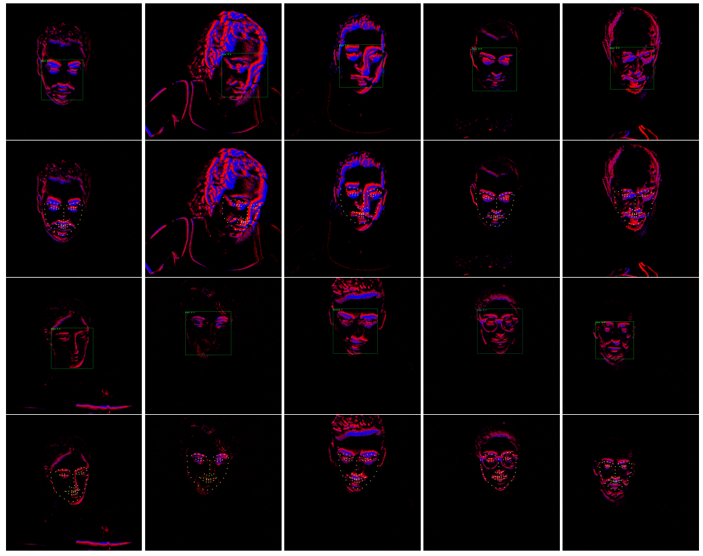

# [CVPR 2023] NEFER a Dataset for  Neuromorphic Event-based Facial Expression Recognition

We present NEFER, a dataset for Neuromorphic Event-based Facial Expression Recognition. NEFER is composed of paired RGB and event videos representing human faces labeled with the respective emotions and also annotated with face bounding boxes and facial landmarks.

Read the paper: [CVF](https://openaccess.thecvf.com/content/CVPR2023W/EventVision/papers/Berlincioni_Neuromorphic_Event-Based_Facial_Expression_Recognition_CVPRW_2023_paper.pdf) | [Arxiv](https://arxiv.org/abs/2304.06351)

## Data and annotations

You can download the data at the following link: [GOOGLE DRIVE LINK](https://drive.google.com/drive/folders/1OAnM8B88XX_TqJj2XF61w1nA-nWNV4YC?usp=sharing)

This folder contains the NEFER dataset, that accopanies the paper "Neuromorphic Event-based Facial Expression Recognition".

The dataset is composed of RGB and Event camera sequences of users observing videos. We labeled each video with an emotion label among the 7 universal emotions defined by Paul Ekman in [1]:

* Disgust
* Contempt
* Happiness
* Fear
* Anger
* Surprise
* Sadness

We use two annotation versions: an annotation according to the emotions that the videos were supposed to generate and an annotation based on what has been subjectively perceived by the user. In the latter case we use an additional label "None" when no emotion has been perceived by a volunteer. 

Training set users:
['01', '02', '04', '05', '06', '08', '09', '10', '11', '12', '13', '14', '15', '16','21', '22', '23', '24', '25', '26']

Validation set users:
['03', '07', '17', '19', '27', '28']

### Dataset structure
- event_raw: a folder with raw event camera videos
- event_frames: a folder with event frames obtained with Temporal Binary Representation [2].
- rgb_frames: contains rgb video frames.
- annotations: contains several csv files for train and validation for both rgb and event data (expected_emotions). Each file also has a correspondent "subjective" version (reported_emotions), with annotations provided by the users.

[1] Ekmann, P.: Universal facial expressions in emotion. Studia Psychologica 15(2), 140 (1973)]

[2] Innocenti S. U., Becattini F., Pernici F., Del Bimbo A.: Temporal binary representation for event-based action recognition. 25th International Conference on Pattern Recognition (ICPR), 10426-10432 (2020)

## Additional annotation
Face landmarks and bounding boxes are going to be available soon.

# Citation

If you find this useful, please cite our work:

> @inproceedings{berlincioni2023neuromorphic,
  title={Neuromorphic Event-based Facial Expression Recognition},
  author={Berlincioni, Lorenzo and Cultrera, Luca and Albisani, Chiara and Cresti, Lisa and Leonardo, Andrea and Picchioni, Sara and Becattini, Federico and Del Bimbo, Alberto},
  booktitle={Proceedings of the IEEE/CVF Conference on Computer Vision and Pattern Recognition},
  pages={4108--4118},
  year={2023}
}
